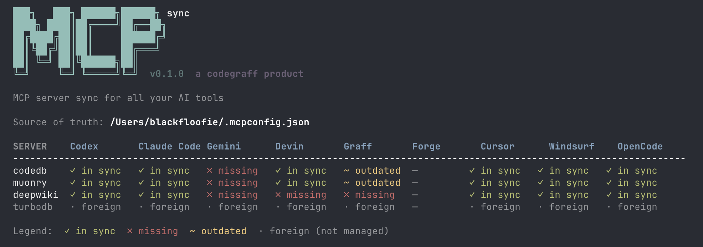

<div align="center">



**One config. Every AI tool. Always in sync.**

*a [codegraff](https://codegraff.com) product*

</div>

---

`mcpsync` keeps your MCP servers identical across every AI coding tool you use — Claude Code, Cursor, Windsurf, OpenCode, Gemini CLI, Graff, and Forge — from a single source-of-truth file at `~/.mcpconfig.json`.

Add a server once. Run `mcpsync sync`. Done.

## Why mcpsync?

- **One source of truth** — `~/.mcpconfig.json` is the only file you ever edit
- **Additive sync** — tool-specific servers you've added manually are never touched
- **Atomic writes** — all config updates use temp-file + rename, never corrupting a live tool
- **Seven tools at once** — Claude Code, Cursor, Windsurf, OpenCode, Gemini, Graff, Forge
- **Single static binary** — written in Zig, no runtime, no dependencies

## Install

```bash
curl -fsSL https://mcpsync.codegraff.com | bash
```

Or build from source (requires Zig 0.16+):

```bash
git clone https://github.com/justrach/mcpsync
cd mcpsync && zig build -Doptimize=ReleaseFast
cp zig-out/bin/mcpsync ~/bin/mcpsync
```

## Quick start

```bash
# Bootstrap: pull existing MCP configs from all your tools into ~/.mcpconfig.json
mcpsync init

# See what's in sync and what isn't
mcpsync status

# Push source-of-truth to every tool
mcpsync sync

# Preview changes without applying them
mcpsync diff
```

## Status table

```
  SERVER    Claude Code Cursor      Windsurf    OpenCode    Gemini      Graff       Forge       Factory Droid
  --------------------------------------------------------------------------------------------------------------
  codedb    ✓ in sync   ✓ in sync   ✓ in sync   ✓ in sync   ✓ in sync   ✓ in sync   ✓ in sync   ✓ in sync
  muonry    ✓ in sync   ✓ in sync   ✓ in sync   ✓ in sync   ✓ in sync   ✓ in sync   ✓ in sync   ✓ in sync
  deepwiki  ✓ in sync   ✓ in sync   ✓ in sync   ✓ in sync   ✓ in sync   ✓ in sync   ✓ in sync   ✓ in sync

  Legend:  ✓ in sync  ✗ missing  ~ outdated  · foreign (not managed)
```

## Managing servers

```bash
# Add a stdio server
mcpsync add myserver --cmd /usr/local/bin/myserver --args --mcp

# Add an HTTP/SSE server
mcpsync add myserver --url https://example.com/mcp

# Remove a server
mcpsync remove myserver

# List all managed servers
mcpsync list
```

## How it works

```
~/.mcpconfig.json  ← single source of truth
        │
        ├─ mcpsync sync
        │
        ├──► ~/.claude/settings.json        (Claude Code)
        ├──► ~/.cursor/mcp.json             (Cursor)
        ├──► ~/.codeium/windsurf/mcp_config.json  (Windsurf)
        ├──► ~/.config/opencode/mcp.json    (OpenCode)
        ├──► ~/.gemini/settings.json        (Gemini CLI)
        ├──► ~/codegraff/.mcp.json          (Graff)
        ├──► ~/forge/mcp.json               (Forge)
        └──► ~/.factory/mcp.json            (Factory Droid)
```

Each tool's config is merged surgically — only the `mcpServers` key is replaced. Every other key in the file (hooks, keybindings, theme settings) is round-tripped verbatim. Foreign servers that exist in a tool but not in your source-of-truth are preserved and shown as `· foreign`.

## Source of truth format

`~/.mcpconfig.json` is plain JSON, tool-agnostic:

```json
{
  "mcpServers": {
    "myserver": {
      "command": "/usr/local/bin/myserver",
      "args": ["--mcp"]
    },
    "remote": {
      "url": "https://example.com/mcp"
    }
  }
}
```

## All commands

| Command | Description |
|---|---|
| `mcpsync` / `mcpsync status` | Sync grid: every server × every tool |
| `mcpsync sync` | Push source-of-truth to all tools |
| `mcpsync diff` | Preview what sync would change |
| `mcpsync init` | Bootstrap `~/.mcpconfig.json` from existing tool configs |
| `mcpsync list` | List managed servers |
| `mcpsync add <name> --cmd <path> [--args ...]` | Add a stdio server |
| `mcpsync add <name> --url <url>` | Add an HTTP/SSE server |
| `mcpsync remove <name>` | Remove a server |

## Supported tools

| Tool | Config file |
|---|---|
| Claude Code | `~/.claude/settings.json` |
| Cursor | `~/.cursor/mcp.json` |
| Windsurf | `~/.codeium/windsurf/mcp_config.json` |
| OpenCode | `~/.config/opencode/mcp.json` |
| Gemini CLI | `~/.gemini/settings.json` |
| Graff | `~/codegraff/.mcp.json` |
| Forge | `~/forge/mcp.json` |
| Factory Droid | `~/.factory/mcp.json` |

## Built with

- [Zig](https://ziglang.org) 0.16
- No external dependencies
